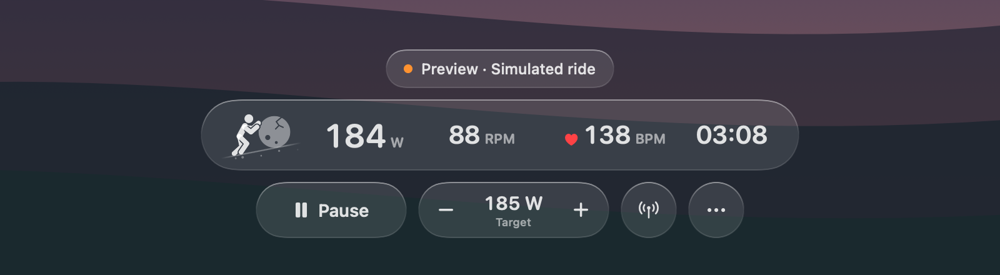
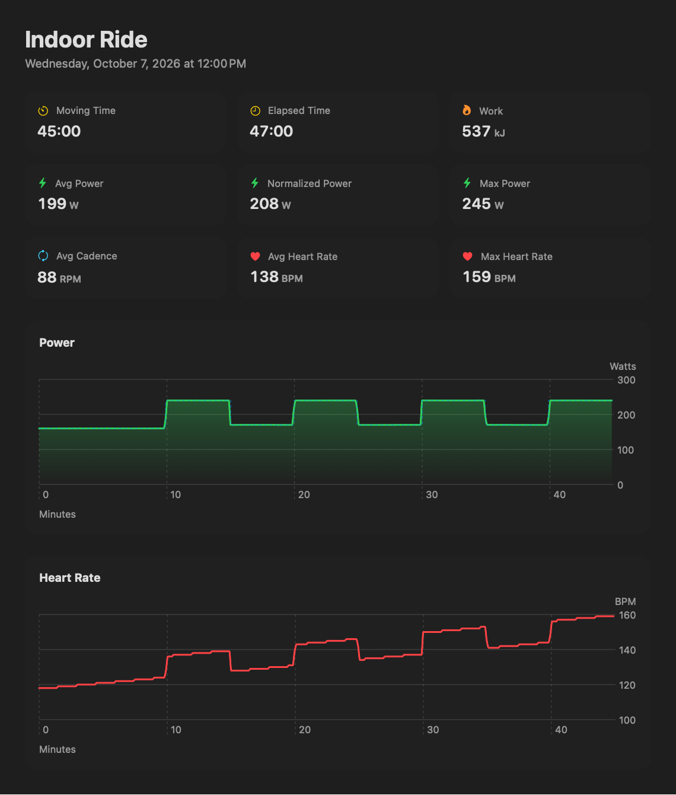

<p align="center">
  
</p>

<h1 align="center">Sisyphus</h1>

<p align="center">
  <strong>A Liquid Glass ERG overlay for your Mac.</strong><br>
  Ride your smart trainer to anything you're watching, while a tiny Sisyphus pushes his boulder one step per pedal stroke.
</p>

<p align="center">
  
  
  
  
</p>

<p align="center">
  
</p>


Sisyphus floats a small glass readout over full-screen Netflix, YouTube or anything else, holds your trainer at a target wattage (ERG mode), and gets out of the way. No account, no subscription, no workout plan, no server: one native Mac app talking Bluetooth to your trainer.

- **Ride over anything.** A floating panel that joins other apps' full-screen spaces. Controls tuck away mid-ride and come back when you point at them; click-through mode lets clicks reach the video underneath.
- **ERG over standard Bluetooth.** Built on the Fitness Machine Service (FTMS) that the Wahoo KICKR and most current smart trainers speak.
- **Heart rate** from any Bluetooth sensor, including AirPods Pro 3 through an iPhone bridge app.
- **Ride history** with Apple Fitness–style summaries, normalized power, power and heart rate charts, and TCX export.
- **Strava upload**, straight from your Mac to your own Strava API app.
- **A character worth riding with.** Drawn in the style of SF Symbols and animated by your cadence: one step per crank revolution, feet planted, boulder rolling exactly as far as he walks.

<p align="center">
  
</p>

> **Status: early.** Trainer control follows the Bluetooth FTMS specification, and its packet parsing and command sequencing are covered by tests. Reports from riders on different trainers are very welcome; please [open an issue](../../issues) with your trainer model.

## Install

Requires macOS 26 or newer and Apple's Command Line Tools (`xcode-select --install`). There are no dependencies, and Xcode isn't needed.

Clone this repository, then from its folder:

```sh
bash scripts/install.sh
open /Applications/Sisyphus.app
```

The install script builds the app and puts it in Applications, where Launchpad and Spotlight find it. While it's running, Control-click its Dock icon and choose **Options › Keep in Dock**. Run the script again to update. To build without installing, use `bash scripts/build.sh` and open `build/Sisyphus.app`.

Use **Connect** (or the antenna button) to find and explicitly select your trainer. Allow Bluetooth access when macOS asks. Connection alone does **not** send ERG commands; press **Start** to request control and apply the displayed target. Close other trainer-control apps first.

No trainer? Try the simulated preview, which never scans for, connects to or controls hardware:

```sh
open /Applications/Sisyphus.app --args --demo
```

## How it's built

A small codebase that shows off a few things that are fun to get right on macOS 26:

- **Liquid Glass in SwiftUI on the Mac.** The readout, status capsule and controls share one `GlassEffectContainer`, and `glassEffectID` morphs the full readout into the compact pill. It all lives in a nonactivating `NSPanel` that floats over other apps' full-screen spaces.
- **A procedural, SF Symbols–style character.** Two-bone inverse kinematics place the knees and elbows. One distance drives the feet, the ground and the boulder, so planted feet never slide, and the whole scene repeats exactly every seven strides. Knockout gaps separate overlapping limbs the way SF Symbols do. It draws straight into a 30 fps canvas with no offscreen layers, and stops drawing entirely when you stop pedaling.
- **ERG over Bluetooth.** A CoreBluetooth implementation of the Fitness Machine Service: feature and range discovery, Indoor Bike Data parsing, and a control-point queue that only advances on the trainer's acknowledgement.
- **Strava without a server.** OAuth through a one-shot loopback listener on `127.0.0.1`, tokens in the Keychain, and TCX v2 files validated against Garmin's schema.
- **Command Line Tools only.** Swift Package Manager builds the app bundle and icon, and the tests run without XCTest.

```
Sources/SisyphusCore   FTMS parsing, trainer commands, ride timing, ride log, TCX, Strava requests (pure, tested)
Sources/Sisyphus       App: overlay, character, trainer connection, rides window, Strava client
Tests/                 Core checks and an integration harness for recording and uploads
scripts/               build, install, test and integration scripts
```

## Interface

- Live power, target watts, cadence, optional heart rate, time at the current target, and total active ride time.
- A rolling three-minute power trace with a dashed target line. Missing readings appear as gaps, not zero watts.
- Manual ERG target in 5 W steps, aligned to the trainer's supported range (up to 1,000 W).
- Start, pause and resume. Once paused, **End** saves the ride and opens its summary; **Discard Ride…** in the options menu throws it away after confirming. Changing the confirmed target starts a new interval; there is no scheduled workout or invented countdown/end time.
- Cadence-driven character: one step per crank revolution. Planted feet never slide and the stone rolls exactly as far as he walks. When pedaling stops he walks on into a two-footed stance rather than freezing mid-stride. He stays still under Reduce Motion, and the animation stops drawing entirely while paused.
- Liquid Glass throughout. The readout, status capsule and controls share one glass container, so switching to compact morphs the readout into a pill.
- Controls stay visible until you start riding, then tuck away and reappear when the pointer moves over the overlay.
- Drag the overlay to reposition it. Choose size, compact mode, or click-through from the options (•••) menu.
- A regular Dock app. Clicking the Dock icon brings the overlay back and ends click-through, and its Control-click menu starts or pauses the ride and opens Rides. The mountain icon in the menu bar does the same while full-screen video hides the Dock.
- A macOS 26–style icon: a lit color field, a frosted glass hillside, a glass boulder and a bold Sisyphus, on Apple's 824-point icon grid so macOS shows it as a native tile.
- A nonactivating floating panel configured to join other apps' full-screen spaces and Stage Manager. Actual Netflix/YouTube full-screen behavior must be verified on your setup.

Unsupported or stale measurements display a dash. There are no accounts, subscriptions or workout plans.

## Heart rate and AirPods Pro 3

Any standard Bluetooth heart rate sensor works, as does a trainer that relays heart rate. Sisyphus remembers the last sensor and reconnects it at launch and whenever it drops out.

AirPods Pro 3 can't connect to a Mac app directly. They don't broadcast the standard Bluetooth heart rate signal, and their heart rate reaches apps only through Apple Health on iPhone during a workout. To use them, run an iPhone app that reads that heart rate and rebroadcasts it as a standard sensor, such as [AirHRM](https://airhrm.app/) or [HeartCast](https://apps.apple.com/us/app/heartcast-heart-rate-monitor/id1499771124). Start it, then choose your iPhone under **Nearby** in the devices popover. Keep that app in the foreground if your heart rate drops out. These are third-party apps and haven't been tested with Sisyphus.

## Rides and Strava

Rides are recorded once per second while you're riding (pauses become gaps) and autosaved every 30 seconds, so a crash or power cut loses at most that much; the next launch recovers it. Simulated preview rides are never saved. Open **Rides…** from the options menu or the menu bar to see each ride's moving and elapsed time, average, normalized and max power, work, cadence and heart rate, with power and heart rate charts. **Export TCX…** saves a Garmin TCX v2 file that any training site can import.

<p align="center">
  
</p>

To upload to Strava, Sisyphus uses a Strava API application that you own; there's no Sisyphus server in between:

1. At [strava.com/settings/api](https://www.strava.com/settings/api), create an application. Any name and website will do; set **Authorization Callback Domain** to `localhost`.
2. In **Rides**, click **Connect Strava…**, paste the Client ID and Client Secret, and click **Connect**. Approve in the browser, leaving *Upload your activities* checked.
3. Use **Upload to Strava** on any ride, or turn on **Upload rides when you end them**.

Rides upload as indoor (trainer) rides with power, cadence and heart rate. A ride Strava already has is linked rather than duplicated. Deleting a ride in Sisyphus doesn't delete it from Strava.

Rides are stored as JSON in `~/Library/Application Support/Sisyphus/Rides`. The Strava Client Secret and tokens are kept in your login Keychain. Because the build is ad-hoc signed, macOS may ask to allow Keychain access again after you rebuild; choose **Always Allow**. While you connect, Sisyphus listens on `127.0.0.1` for Strava's redirect, so the macOS firewall may ask to allow incoming connections.

## Trainer support and lifecycle

The connection implements the standard Bluetooth Fitness Machine Service (FTMS), including feature/range discovery, Indoor Bike Data, control-point indications, and the Heart Rate Service. KICKRs exposing FTMS are the initial target. Older models using only Wahoo's proprietary control protocol or ANT+ are not supported by this build. Exact hardware compatibility needs a ride test.

Commands are serialized and completed only after a matching trainer indication, with target updates coalesced and queued targets discarded on pause. The app shows a control error on denial or timeout, discards stale data, and requires explicit reconnection/resume after connection loss. It requests pause when power data stops. Normal quit sends Stop and Reset before disconnecting. On sleep it requests pause and never automatically resumes. A forced process exit, OS failure, or radio loss cannot guarantee the trainer received a stop command.

## Develop and validate

```sh
bash scripts/test.sh
bash scripts/integration.sh
build/Sisyphus.app/Contents/MacOS/Sisyphus --demo --smoke
build/Sisyphus.app/Contents/MacOS/Sisyphus --render "$PWD/build/Sisyphus-preview.png"
build/Sisyphus.app/Contents/MacOS/Sisyphus --render "$PWD/build/Sisyphus-preview-compact.png" --compact
build/Sisyphus.app/Contents/MacOS/Sisyphus --render "$PWD/build/Sisyphus-preview-paused.png" --paused
build/Sisyphus.app/Contents/MacOS/Sisyphus --render-gif "$PWD/docs/sisyphus.gif"
```

The offline preview renderer uses the same SwiftUI layout over an original illustrated backdrop, with an approximation of glass (native Liquid Glass requires the window server). It does not capture the desktop or streaming video. The smoke command uses only simulated data. The dependency-free test executable works with command line tools alone; full Xcode/XCTest is not required.

Tests cover packet variants and truncation, cadence scaling, heart rate contact flags, target bounds/steps, command sequencing and rejection, paused timing, missing samples, bounded history, ride summaries and normalized power, TCX export, and Strava request building and response handling. The integration script runs the app's own recording and upload code: autosave and crash recovery, discarding, a lost connection, token refresh, upload polling, duplicates, errors, sign-out, and the OAuth redirect. It uses a temporary folder, a temporary Keychain item and a stubbed Strava, so it never touches real data or the network. Bluetooth behavior on a physical KICKR, a live Strava account, and full-screen media playback require manual validation. The build is locally ad-hoc signed; it is not a notarized public distribution.

## Source references

- [TrainerRoad Minimal Mode reference](https://support.trainerroad.com/hc/trainerroad-support/articles/115000095406-using-entertainment-with-trainerroad): data selection, not artwork or layout.
- [Bluetooth SIG Fitness Machine Service](https://www.bluetooth.com/specifications/specs/fitness-machine-service-1-0/).
- [Apple Liquid Glass](https://developer.apple.com/documentation/swiftui/view/glasseffect(_:in:)) and [GlassEffectContainer](https://developer.apple.com/documentation/swiftui/glasseffectcontainer).
- [Strava authentication](https://developers.strava.com/docs/authentication/) and [uploads](https://developers.strava.com/docs/uploads/).
- [Garmin TCX v2 schema](https://www8.garmin.com/xmlschemas/TrainingCenterDatabasev2.xsd).
- [Apple floating-window collection behavior](https://developer.apple.com/documentation/appkit/nswindow/collectionbehavior-swift.struct/canjoinallapplications).

## Contributing

Issues and pull requests are welcome, especially trainer compatibility reports, structured workout support and translations. Run `bash scripts/test.sh` and `bash scripts/integration.sh` before sending a change.

## License

[MIT](LICENSE) © 2026 Justin Valentine
