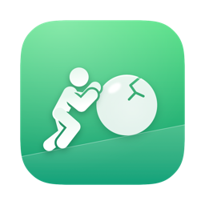
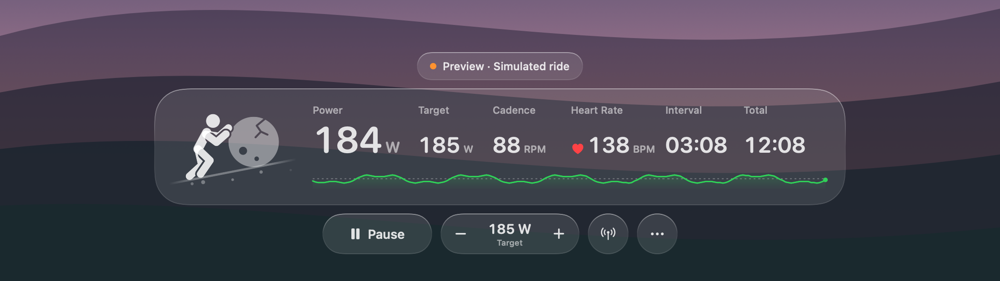

<p align="center">
  
</p>

<h1 align="center">Sisyphus</h1>

<p align="center">
  <strong>A Liquid Glass ERG overlay for your Mac.</strong><br>
  Ride your smart trainer to anything you're watching, while a tiny Sisyphus pushes his boulder one step per pedal stroke.
</p>

<p align="center">
  
  
  
  
</p>

<p align="center">
  
</p>

<p align="center">
  
</p>

Sisyphus floats a small glass readout over full-screen Netflix, YouTube or anything else, holds your trainer at a target wattage (ERG mode), and gets out of the way. No account, no subscription, no workout plan, no server: one native Mac app talking Bluetooth to your trainer.

- **Ride over anything.** A floating panel that joins other apps' full-screen spaces. Controls tuck away mid-ride and come back when you point at them; click-through mode lets clicks reach the video underneath.
- **ERG over standard Bluetooth.** Built on the Fitness Machine Service (FTMS) that the Wahoo KICKR and most current smart trainers speak.
- **Heart rate** from any Bluetooth sensor, including AirPods Pro 3 through an iPhone bridge app.
- **Ride history** with Apple Fitness–style summaries, normalized power, power and heart rate charts, and TCX export.
- **Strava upload**, straight from your Mac to your own Strava API app.
- **A character worth riding with.** Drawn in the style of SF Symbols and animated by your cadence: one step per crank revolution, feet planted, boulder rolling exactly as far as he walks.

## install

Requires macOS 26 and the Command Line Tools (`xcode-select --install`). No Xcode, no dependencies.

```sh
git clone https://github.com/JustinValentine/Sisyphus.git
cd Sisyphus
bash scripts/install.sh
```

This builds the app and copies it to `/Applications`. To try it without a trainer:

```sh
open /Applications/Sisyphus.app --args --demo
```

Connecting a trainer doesn't change the resistance until you press Start. Quit other trainer apps first, only one app can control a trainer at a time.

## trainers

Bluetooth FTMS only. That covers most trainers from the last few years: KICKR, KICKR Core, Elite, Saris, Zwift Hub, most Tacx. Some Tacx NEOs use their own protocol and won't work yet. No ANT+.

It's early. If your trainer works, or doesn't, please open an [issue](https://github.com/JustinValentine/Sisyphus/issues).

## heart rate

Any Bluetooth heart rate strap. AirPods Pro 3 don't expose heart rate to the Mac, so you'd need an iPhone app that rebroadcasts it as a standard sensor (e.g. [AirHRM](https://airhrm.app/), [HeartCast](https://apps.apple.com/us/app/heartcast-heart-rate-monitor/id1499771124)). Untested.

## rides and strava

Rides are saved locally to `~/Library/Application Support/Sisyphus/Rides`, autosaved every 30s. You can export a ride as TCX or upload it to Strava.

Strava upload goes through your own API app (new Strava apps are limited to one athlete by default, so this is the simplest way):

1. Create an app at [strava.com/settings/api](https://www.strava.com/settings/api) with callback domain `localhost`.
2. In Sisyphus: Rides → Connect Strava…, paste the client ID and secret.
3. Upload.

## dev

```sh
bash scripts/test.sh          # unit tests
bash scripts/integration.sh   # recording and Strava upload against a stub
```

- `Sources/SisyphusCore`: FTMS parsing, ride math, TCX, Strava requests. Pure and tested.
- `Sources/Sisyphus`: the app. The character is ~200 lines in `SisyphusScene.swift`: two-bone IK, one shared distance for feet, ground and stone so nothing slides.

## todo

- structured workouts (.zwo, .erg)
- Tacx NEO protocol
- notarized release

## notes

Written in part with [Claude Code](https://claude.com/claude-code).

## license

MIT
